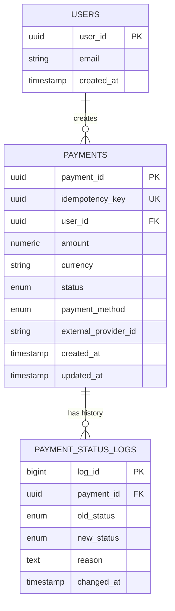

```mermaid
erDiagram
    USERS ||--o{ PAYMENTS : "creates"
    PAYMENTS ||--o{ PAYMENT_STATUS_LOGS : "has history"

    USERS {
        uuid user_id PK
        string email
        timestamp created_at
    }

    PAYMENTS {
        uuid payment_id PK
        uuid idempotency_key UK
        uuid user_id FK
        numeric amount
        string currency
        enum status
        enum payment_method
        string external_provider_id
        timestamp created_at
        timestamp updated_at
    }

    PAYMENT_STATUS_LOGS {
        bigint log_id PK
        uuid payment_id FK
        enum old_status
        enum new_status
        text reason
        timestamp changed_at
    }
```