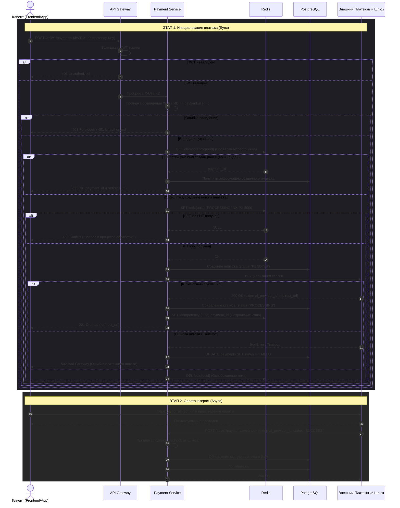

```mermaid
sequenceDiagram
	autonumber
    actor Client as Клиент (Frontend/App)
    participant GW as API Gateway
    participant API as Payment Service
    participant Cache as Redis
    participant DB as PostgreSQL
    participant Gateway as Внешний Платежный Шлюз

    rect rgba(32, 30, 37, 1)
    note over Client, Gateway: ЭТАП 1: Инициализация платежа (Sync)
    Client->>GW: POST /api/v1/payments (JWT, X-Idempotency-Key)
	GW->>GW: Валидация JWT токена
	alt JWT невалиден
        GW-->>Client: 401 Unauthorized
	else JWT валиден
    	GW->>API: Проброс с X-User-ID
        API->>API: Проверка совпадения X-User-ID == payload.user_id
		alt Ошибка валидации
            API-->>Client: 403 Forbidden / 401 Unauthorized
        else Валидация успешна

        API->>Cache: GET idempotency:{uuid} (Проверка готового кэша)
        alt 1. Платеж уже был создан ранее (Кэш найден)
            Cache-->>API: payment_id
            API->>DB: Получить информацию созданного платежа
            API-->>Client: 200 OK (payment_id и redirect_url)
        else 2. Кэш пуст, создание нового платежа
            API->>Cache: SET lock:{uuid} "PROCESSING" NX PX 5000
            alt SET lock НЕ получен
                Cache-->>API: NULL
                API-->>Client: 409 Conflict ("Запрос в процессе обработки")
            else SET lock получен
                Cache-->>API: OK
                API->>DB: Создание платежа (status='PENDING')
                API->>Gateway: Инициализация сессии
                alt Шлюз ответил успешно
                    Gateway-->>API: 200 OK (external_provider_id, redirect_url)
                    API->>DB: Обновление статуса (status='PROCESSING')
                    API->>Cache: SET idempotency:{uuid} payment_id (Сохранение кэша)
                    API-->>Client: 201 Created (redirect_url)
                else Ошибка шлюза / Таймаут
                    Gateway-->>API: 5xx Error / Timeout
                    API->>DB: UPDATE payments SET status = 'FAILED'
                    API-->>Client: 502 Bad Gateway (Ошибка платежного шлюза)
                end
                API->>Cache: DEL lock:{uuid} (Освобождение лока)
            end
	    end
 	end
    end
    end

    rect rgba(39, 39, 39, 1)
    note over Client, Gateway: ЭТАП 2: Оплата юзером (Async)
    Client->>Gateway: Переход по redirect_url и произведение оплаты
    Gateway-->>Client: Платеж успешно проведен
    Gateway->>API: POST /api/v1/payments/webhook (external_provider_id, status='SUCCESS')
    API->>API: Проверка подписи webhook от шлюза
    API->>DB: Обновление статуса платежа в базе
    API->>DB: Лог платежа
    API-->>Gateway: 200 OK
    end
```